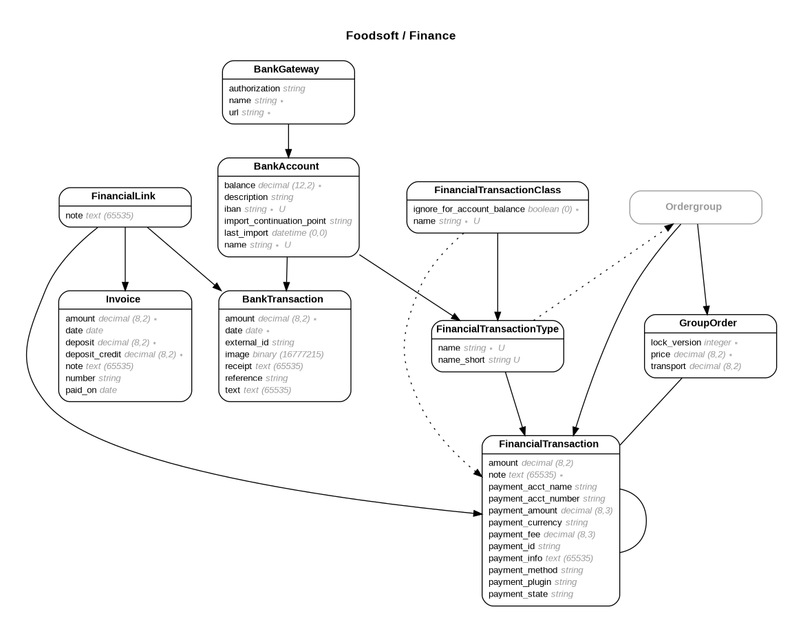

# Finance

## Entity-Relationship Diagram

> bundle exec erd --cluster --inheritance --open --only "BankAccount,BankGateway,BankTransaction,FinancialLink,FinancialTransactionClass,FinancialTransactionType,FinancialTransaction,Invoice"  --title "Foodsoft / Finance" --filetype=png

### Financial Transaction (ft)

* The amount of a Financial Transaction may be `null`, indicating that it's incomplete (e.g., a Mollie online payment).
* Payment attributes can be used by payment provider plugins to keep track of external references/state, etc.

### Financial Transaction Type

Types should be used to add structured information to a transaction. For example, this could be used to have different types depending on the source of money (cash vs. bank transfer).

### Financial Transaction Class

Classes are shown as different columns in the tables and are used to group transactions of specific types. They should be used if not the whole amount of the order group should be used to order food. For example, if there is a deposit or membership fee, which is independent of the normal credit.

### Invoice
### Bank Account
### Bank Gateway
### Bank Transaction
### Financial Link